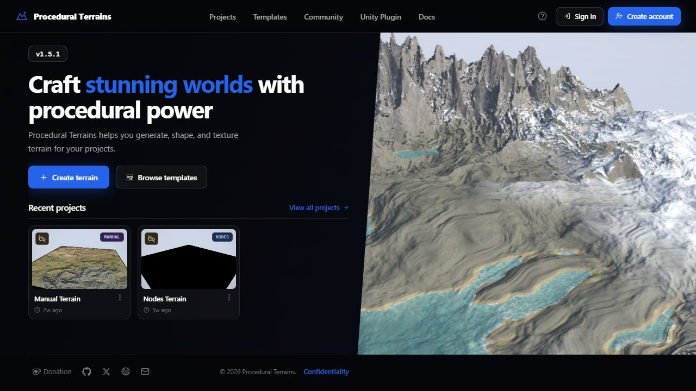
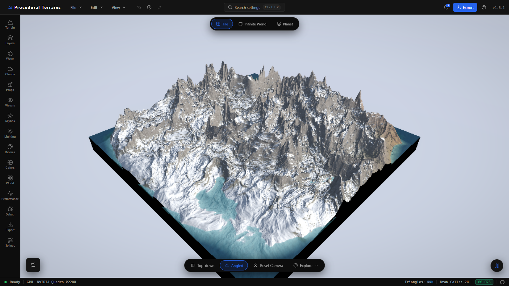
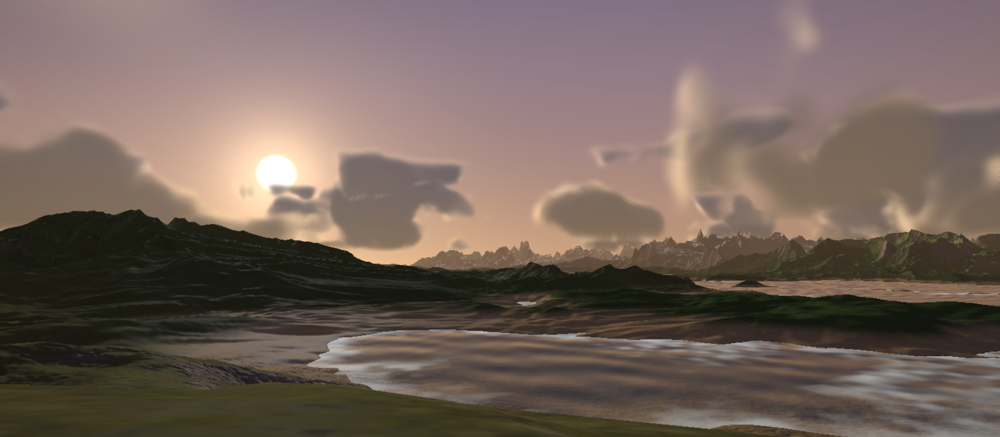
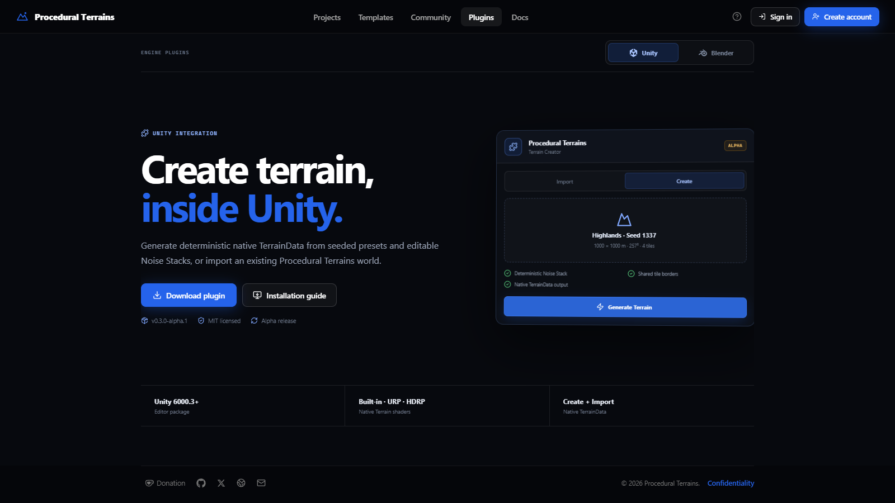
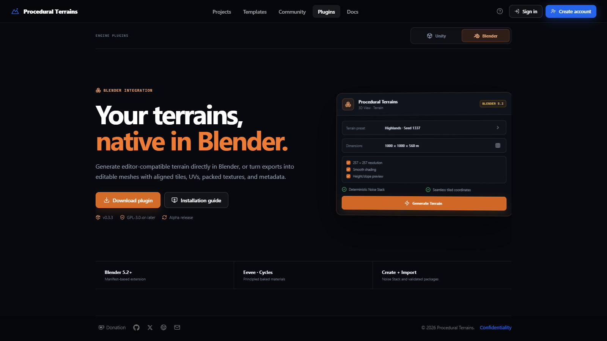

# Procedural Terrains

GPU-driven terrain authoring for the browser, with native integrations for
Unity and Blender.



Procedural Terrains is a React + Vite + Three.js terrain studio. Height,
normals, and biome colors are evaluated on the GPU, so the live view stays
editable without relying on a baked CPU heightmap.

## What’s new

- **Unity integration 0.3.0-alpha.1** — create seeded terrain directly in the
  Unity Editor, generate tiled `TerrainData`, connect neighbors, and regenerate
  saved recipes.
- **Blender extension 0.3.3** — create editable procedural meshes in Blender
  5.2, import validated export packages, preserve source metadata, and resize
  imported assemblies.
- **Real-world terrain mode** — search for a location, preview geographic
  elevation and imagery, then load it into the editor.
- **Production export presets** — prepare Unity, Unreal, Godot, Blender, and
  Three.js packages with meshes, textures, masks, water data, and metadata.
- **Local-first projects** — save versioned projects, thumbnails, templates,
  and recent-project history in the browser without requiring an account.

## Features at a glance

| Capability | Description |
| --- | --- |
| **Tile** | Paint, assemble, and export fixed terrain boards with per-chunk LOD. |
| **Infinite World** | Explore a streamed chunk grid with walk and fly-through controls. |
| **Planet** | Generate a cube-sphere planet with atmosphere, clouds, and orbit controls. |
| **Noise Stack** | Compose typed, serializable noise layers that compile to GLSL. |
| **Manual terrain** | Import real-world elevation or shape terrain with brushes. |
| **Water and atmosphere** | Add water, shoreline effects, sky, clouds, fog, and underwater rendering. |
| **Export** | Bake GLB/GLTF, OBJ, color, normal, height, splat, collision, water, and preset data. |

## See it in action

### Terrain studio



The editor supports multiple world modes, live shader parameters, settings
search, camera presets, performance controls, undo/redo, and project save/load.



Example terrain scene with reflective water, atmospheric lighting, clouds, and
mountain silhouettes.

### Engine plugins

| Unity | Blender |
| --- | --- |
|  |  |

Both integrations can import the same renderer-neutral `.ptrterrain` runtime
document and production ZIP exports. They also expose native procedural
generation for their host application. These screenshots are generated from
the local app with Playwright at a 1600 × 900 viewport.

## Quick start

```sh
npm install
npm run dev
```

Open [http://localhost:6061](http://localhost:6061). Vite listens on all
interfaces and prints a LAN URL; if port `6061` is busy, it selects the next
available port.

Create a production build with:

```sh
npm run build
npm run preview
```

### Optional accounts API

The editor is local-first and fully usable without an account. Login and
registration are provided by the independent, self-hostable Node.js/MySQL
service in [`api/`](api/).

```sh
cp .env.example .env
cp api/.env.example api/.env
npm --prefix api install
npm run dev
npm run dev:api
```

Run `npm run migrate:api` once MySQL is configured. Deployment guidance for
Linux, PM2, MySQL, and Nginx is in [`api/README.md`](api/README.md).

## Unity and Blender plugins

The latest archives are available from the app and checked into
[`public/downloads/plugins/`](public/downloads/plugins/).

| Integration | Version | Requirements | Source | Download |
| --- | --- | --- | --- | --- |
| **Unity** | `0.3.0-alpha.1` | Unity `6000.3+` | [`plugins/unity/Packages/com.zyfou.procedural-terrains`](plugins/unity/Packages/com.zyfou.procedural-terrains) | [`Unity ZIP`](public/downloads/plugins/procedural-terrains-unity-0.3.0-alpha.1.zip) |
| **Blender** | `0.3.3` | Blender `5.2+` | [`plugins/blender/procedural_terrains`](plugins/blender/procedural_terrains) | [`Blender ZIP`](public/downloads/plugins/procedural-terrains-blender-0.3.3.zip) |

### Unity workflow

1. Download the Unity ZIP or add the local package through Unity Package Manager.
2. In Procedural Terrains, choose the **Unity Terrain** export preset.
3. In Unity, open **Window > Procedural Terrains > Terrain Importer**.
4. Import the ZIP, or use **Create** to generate seeded terrain natively.

The package creates native `TerrainData`, colliders, connected tile neighbors,
TerrainLayers, and persistent generation recipe assets. See the
[Unity package README](plugins/unity/Packages/com.zyfou.procedural-terrains/README.md)
and [Unity changelog](plugins/unity/Packages/com.zyfou.procedural-terrains/CHANGELOG.md)
for current limitations and release details.

### Blender workflow

1. Download `procedural-terrains-blender-0.3.3.zip`.
2. In Blender 5.2, open **Edit > Preferences > Get Extensions > Install from Disk**.
3. Enable the extension and open **3D View > Sidebar > Terrain**.
4. Use **Create** for native procedural terrain or **Import** for a ZIP/
   `.ptrterrain` export.

The extension creates ordinary editable mesh objects with UVs, source metadata,
shared tile borders, and Blender undo support. Read the
[Blender extension README](plugins/blender/procedural_terrains/README.md) for
installation, coordinate mapping, and performance guidance.

## World modes

| Mode | Best for | Details |
| --- | --- | --- |
| **Tile** | Authoring and export | Fixed terrain board, multi-tile layouts, paint brushes, and close-range detail. |
| **Infinite World** | Exploration | Streamed chunks around the camera with FPS walking and plane exploration. |
| **Planet** | Large-scale worlds | Cube-sphere terrain with atmosphere, volumetric clouds, and orbit camera. |

Tile mode also includes square or circular layouts, radial walls, real-world
heightmap import, biome painting, river tools, and procedural prop painting.

## Export pipeline

The Export panel provides quick screenshots and heightmaps, plus production
presets for:

- Unity Terrain
- Unreal Landscape
- Godot Terrain3D
- Blender Scene
- Three.js viewer assets

Full ZIP exports can contain:

- GLB/GLTF or OBJ terrain meshes, with configurable resolution, skirts, and base slabs
- baked color, normal, heightmap, biome splat, and collision maps
- water surface meshes and depth, shoreline, and foam masks
- `terrain.json`, `project.ptrterrain`, and preset metadata for downstream tools

The Production Check validates selections before the GPU bake and flags
high-memory maps or missing water masks.

## Controls

**Tile camera**

- **Left-drag** — pan across the board
- **Right-drag** — orbit
- **Scroll** — zoom
- Bottom toolbar — top-down, angled, and reset camera views

**Exploration**

- Bottom toolbar **Explore** — choose **Walk** or **Plane**
- Touch controls are available on mobile while exploring

**Shortcuts**

- `Ctrl+K` — search settings
- `Ctrl+Z` / `Ctrl+Y` — undo / redo
- `Ctrl+Shift+P` — performance overlay

## Architecture

The WebGL engine is framework-agnostic in [`src/engine/`](src/engine/). The
React editor lives in [`src/components/`](src/components/), and the two layers
communicate through Engine methods and a callbacks object.

| Area | Key files |
| --- | --- |
| **Core** | [`src/engine/Engine.js`](src/engine/Engine.js) — renderer, scene, uniforms, save/load, undo state |
| **Tile board** | [`src/engine/terrain/TerrainBoard.js`](src/engine/terrain/TerrainBoard.js) — board layout and chunk orchestration |
| **Infinite world** | [`src/engine/terrain/InfiniteWorld.js`](src/engine/terrain/InfiniteWorld.js) — streamed chunks and culling |
| **Planet** | [`src/engine/terrain/PlanetWorld.js`](src/engine/terrain/PlanetWorld.js) — cube-sphere world |
| **Noise** | [`src/engine/terrain/noise/NoiseStack.js`](src/engine/terrain/noise/NoiseStack.js) — layered serializable noise |
| **Shaders** | [`src/engine/terrain/terrainGLSL.js`](src/engine/terrain/terrainGLSL.js) and materials |
| **Water** | [`src/engine/water/WaterSystem.js`](src/engine/water/WaterSystem.js) — water, reflections, and underwater effects |
| **Paint** | [`src/paint/PaintModeManager.js`](src/paint/PaintModeManager.js) — height, biome, and prop layers |
| **Export** | [`src/engine/terrain/TerrainExporter.js`](src/engine/terrain/TerrainExporter.js) — mesh and texture packages |
| **UI** | [`src/App.jsx`](src/App.jsx) — application shell and editor composition |

## Technical properties

- **Deterministic:** terrain is a pure function of world coordinates, seed, and parameters.
- **Layered noise:** typed layers are code-generated into the terrain shader and saved with projects.
- **Crack-free LOD:** skirt rings hide transitions between chunks at different detail levels.
- **Live editing:** most controls update shader uniforms without rebuilding geometry.
- **Camera-independent terrain:** the camera affects LOD, never the generated height field.
- **Undo/redo:** project parameters, tile layout, and paint layers are tracked together.
- **Performance controls:** GPU-tier detection, quality presets, LOD budgets, renderer options, and a live overlay.

Normals are finite-differenced per fragment to keep distant terrain crisp at low
geometric LOD. On weaker GPUs, lower pixel ratio, reduce octaves or layer count,
or choose a lighter water quality mode. More profiling notes are in
[`docs/PERFORMANCE.md`](docs/PERFORMANCE.md).

## Project structure

```text
src/                 React UI, engine, exporters, and editor state
plugins/             Unity package and Blender extension
public/downloads/    Downloadable plugin archives
public/textures/     Built-in terrain material textures
api/                 Optional self-hostable accounts service
docs/                Architecture and performance notes
tests/               Frontend and integration tests
```

## License

The core project is released under the [MIT License](LICENSE). Plugin licenses
are documented alongside their source packages: Unity is MIT licensed and the
Blender extension is GPL-3.0-or-later.
